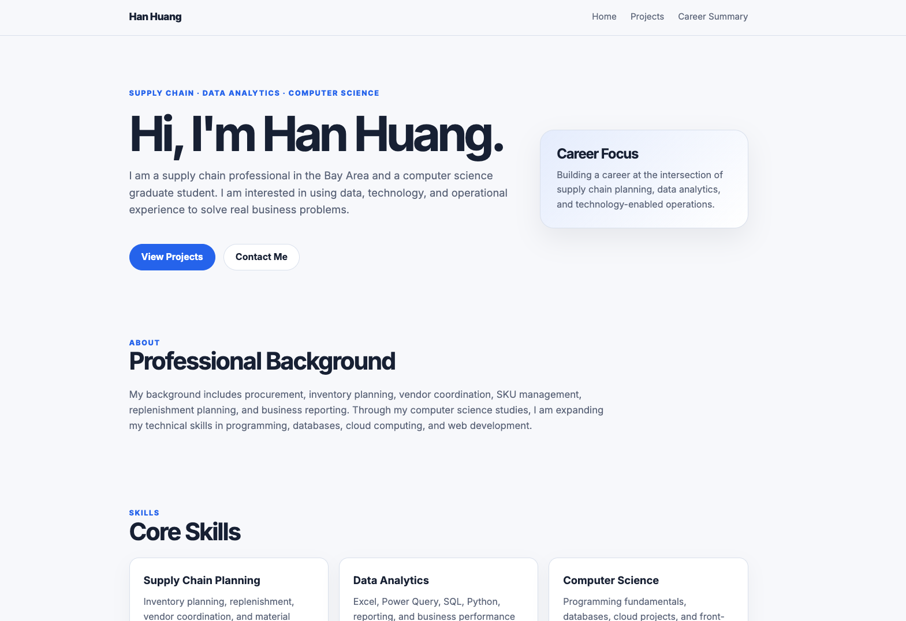

# Personal Home Page

## Author：Han Huang

## Project Objective

This project is require to create a personal home page. My goal is to create a clean and professional portfolio website that can introduces my experience, skills, selected projects.

The website is also designed to be suitable for public sharing on LinkedIn or GitHub Pages.

## Class Link

Add class link here.

## Live Website

Add GitHub Pages link here after deployment.

## Screenshot

Add screenshot here after the website is finished.

Example:

## Project Description

This is a static front-end website built with vanilla HTML5, CSS3, and ES6 JavaScript modules. It does not use a backend, jQuery, or component libraries.

The website includes three pages:

1. Home page
2. Projects page
3. Career Summary page

The home page includes an original interactive Career Map component. Users can click different career focus areas to view related skills and experience.

## Features

- Responsive layout using CSS Grid and Flexbox
- Organized project folders for CSS, JavaScript, images, and documentation
- ES6 module-based JavaScript
- Interactive Career Map component
- Meta author and description information
- Three HTML pages with different URLs
- MIT license
- Prettier and ESLint configuration

## Folder Structure

The project separates HTML, CSS, JavaScript, images, and documentation into different folders. The main files are:

- `index.html`: home page
- `projects.html`: project page
- `ai-page.html`: career summary page
- `css/styles.css`: main stylesheet
- `js/main.js`: JavaScript entry file
- `js/careerMap.js`: interactive Career Map logic
- `docs/design-document.md`: design document
